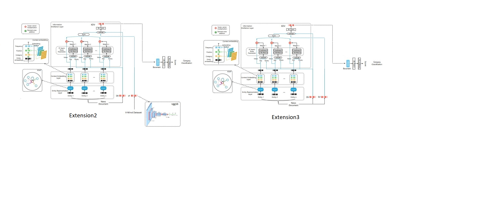

## Introduction

This repository is the implementation of [KRED: Knowledge-Aware Document Representation for News Recommendations](https://arxiv.org/abs/1910.11494)

## Model description



KRED is a knowledge enhanced framework which enhance a document embedding with knowledge information for multiple news recommendation tasks. The framework mainly contains two part: representation enhancement part(left) and multi-task training part(right).

##  Data description:

We use [MIND dataset](https://msnews.github.io) in this repo, due to MIND dataset doesn't contain location information, so in this experiments we do not use the local news detection task.

##  Running the code
we added some extension on KREd to monitor performance of model:

First, we compare different sentence-transformers to evaluate their effectiveness in representing news articles. Specifically, we compare BERT with RoBERTa and XLM model to select the best-performing model for document embedding. 

Second, we incorporate image data from V-MIND, which is an extended version of the MIND dataset that includes news pictures. This extension enables us to match news articles with relevant images, expanding and diversifying the dataset.

Third and last, we use a semantic analysis extension to evaluate if the news has a positive or negative context. This feature is helpful as it can further improve the accuracy of the sentiment analysis and lead to better recommendation results.

new parameter, named 'extension' is added to the config, that define the type of extension. default is KREd(without applying any extension)

```
$ python main.py  (this will run KRED for vert_classify single task training set by default parameters)
```

we also offer a quick example in this notebook: example.ipynb


## Environment
The code has been tested running under Python 3.6.10, with the following packages installed (along with their dependencies):
- numpy==1.19.1
- pytorchtools==0.0.2
- scikit-learn==0.23.2
- scipy==1.5.2
- torch==1.4.0
